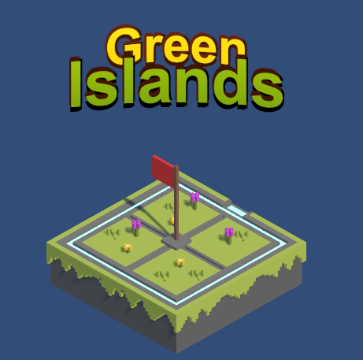
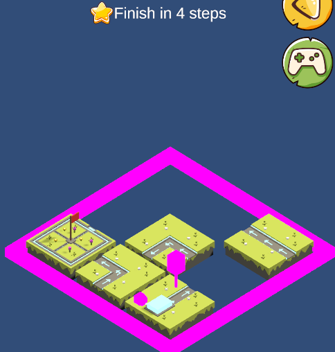

# UGameGridMove
A game with grid floor moving

# 开发进度
简化版（原版本打包太耗时的）而且没有WebGl版本（现默认是WebGL）0

已完成或待完成模块
+ Z注入框架
+ UI动画AnimatePanel.cs
+ 引入 /ToJ Assets/ （UI Effects 可用渐变色,tEXT弯曲）
+ Runtime EventListender 显示在Inspector(--Editor/UnityEventDrawEx/)
+ 打包优化（跨平台）
+ 广告  

# 启动步骤

打开 Scenes/AGameStart.unity

启动